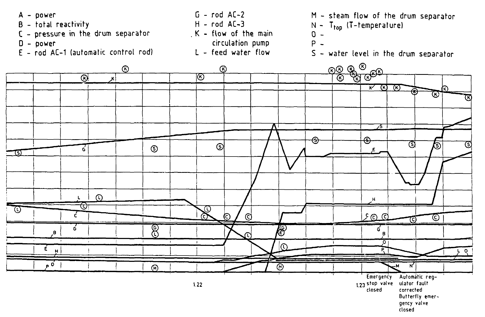
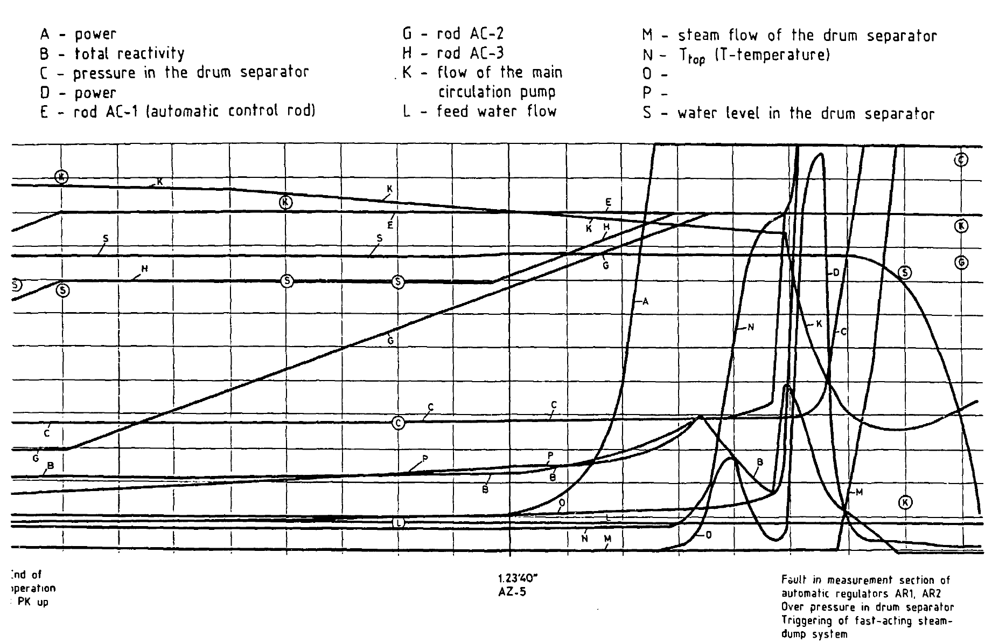

# Chernobyl

The Chernobyl disaster.

A disturbing and compelling interplay of forces between man and machine.

## Motifs I want to explore:

- A tale of two scientists, West vs East at the end of the Cold War era: Gunter Stein (USA) and Valery Legasov (USSR)
- Respect for the unstable - Gunter Stein emphatically demanded that academics teach simple-yet-powerful formal arguments like the Bode integrals to students, and not myopically push fancy math techniques (which can obscure fundamentally dangerous situations/designs)
- Designing for human fallbility - when system failure is extremely dangerous, the system needs to be designed at all levels (inherent stability/instability, hardware like actuators and sensors, man-machine interface ergonomics) to be fault tolerant.
- Blame shifting between system designers and operators

Gunter Stein was insistent that the aim of his critisms around the design flaws in the RBMK reactor at Chernobyl was NOT to discourage nuclear power (as an anti-nuclear power movement was growing swiftly at the time in 1989)

Gunter Stein said the operators (which basically means [Dyatlov](https://en.wikipedia.org/wiki/Anatoly_Dyatlov), [Toptunov](https://en.wikipedia.org/wiki/Leonid_Toptunov), and [Akimov](https://en.wikipedia.org/wiki/Aleksandr_Akimov)) were largely at fault, "they could not have understood some of these basic facts about unstable systems [referring to the necessity of a properly designed and functioning regulator to be in operation to keep the system response stable and bounded] and still do what they did". 
MY WORDS - These people were not low-skilled operators or technicians, they were university-trained engineers with high intelligence and skill. The blame really goes to the educators and educations system for failing to instill these ideas, and to the system's designers and technical documenters to properly disclose the severity of this aspect of the design

"I wonder what the designers could have known? we should have highly redundant reliable hardware that sits there and insists on enforcing the rules when the consequences are so dramatic."

## The major sources I'm revolving around 

Chernodbyl series on TV - https://en.wikipedia.org/wiki/Chernobyl_(miniseries)
- just really well done and entertaining, got me hooked on this history

Gunter Stein's Bode Lecture "Respect the Unstable"

Sweden is in the mix as well for a few tangential reasons:

1. I personally moved to Sweden recently
2. Sweden was where radioactive fallout was first detected after the Chernobyl explosion in 1986
3. Gripen figher suffered an accident due to system instability, described by Gunter Stein
4. Karl J Åström wrote the abstract for the "Respect the Unstable" lecture as represented at https://ethw.org/Archives:Respect_the_Unstable which mentions "At Lund University we made Gunter’s lecture a key part of all courses in control system design."

## Amazing quotes from Stein

"we are responsible for educating the next generation of engineers who are going to be designing controllers for these unstable safety critical systems" referring primarily to jet fighters, airliners, nuclear power plants

"there's a temptation to say 'well we don't do things like that in the West.' but I can't come to that same conclusion. I don't believe that any of the people we train are that much better or that much better trained or that much wiser. Now we don't have nuclear reactors that are unstable, but we do have other systems, systems that I've shown you, dangerous systems, that have important consequences. So I can't come to the conclusion that it's not our problem. I think it is our problem."

there are more, need to rewatch the lecture. he is really good at making emphatic sound bites

https://youtu.be/9Lhu31X94V4?si=VkmdU-gz8tBq1Yel&t=3987

We can see Gunter Stein showing and narrating over graph traces presented by the Soviet investagors at Vienna 1986 - indeed Valerii Legasov was the leader of that delegation, and was probably the one showing those traces to the world for the first time.

That trace can be found in the document from the IAEA https://inis.iaea.org/collection/NCLCollectionStore/_Public/18/001/18001971.pdf on page 53 of 532 in the PDF.

The following graph shows the couple minutes leading up to the explosion of the reactor.

The following graph shows the seconds leading up to the explosion of the reactor.

Notice the annotation on the timeline at 1.23'40" for "AZ-5" corresponding to the pressing of the emergency shutdown button (which was intended to insert all control rods fully and shut the reactor down). This was mentioned in the HBO miniseries as a major plot point while the fictional nuclear physicist Ulana Khomyuk interviewed Akimov and Toptunov while they lay dying of radiation exposure in the hospital in Moscow - they both insisted that "they did nothing wrong" and that they pressed the "AZ-5" button just prior to the reactor exploding, which is consistent with the real-life graph.

That trace can be found in the document from the IAEA https://inis.iaea.org/collection/NCLCollectionStore/_Public/18/001/18001971.pdf on page 54 of 532 in the PDF.

## Legasov's suicide

Concensus of Western sources was that Legasov comitted suicide not to escape a long and painful death by nuclear radiation induced cancer, but rather to escape political pressure from Soviet politicians amidst his growing discontent, or possibly to bring political attention to the failures of the Soviet apparatus to resolve safety issues in the design and operation of Soviet nuclear facilities.

## Sources on Legasov

- https://www.spiegel.de/international/zeitgeist/this-reactor-model-is-no-good-documents-show-politburo-skepticism-of-chernobyl-a-752696.html
- https://time.com/archive/6707086/soviet-union-we-are-still-not-satisfied/
- https://vtoraya-literatura.com/pdf/radio_liberty_report_on_the_ussr_vol01_14_1989__ocr.pdf
- https://diasporiana.org.ua/wp-content/uploads/books/14438/file.pdf
-

## Sources on the Chernobyl disaster

this reddit thread helped: https://www.reddit.com/r/chernobyl/comments/btzxov/can_anyone_share_an_insag1/

- https://inis.iaea.org/collection/NCLCollectionStore/_Public/18/001/18001971.pdf
- https://www.nrc.gov/docs/ML1536/ML15365A567.pdf
- https://ilankelman.org/miscellany/chernobyl.pdf

- https://patriotyk.name/Ukrainika/%D0%86%D1%81%D1%82%D0%BE%D1%80%D1%96%D1%8F/Mould%2C%20R.%20F.%20Chernobyl%20record.%20The%20definitive%20history%20of%20the%20Chernobyl%20catastrophe.%20Bristol%20-%20Pholadelphia%2C%202000.pdf

## Legasov himself railed against certain aspects of the RBMK reactor he saw as flaws.

MY OWN WORDS
However, these design flaws do not belong to the "instability at low operating power regime" critism levied by Gunter Stein and other voices in the West. Rather, Legasov felt that the instability was an acceptable design aspect, and that other layers in the system design, especially as it relates to the man-machine interface and radioactive material containment failsafe/fallback mechanisms, were more important.

from https://en.wikipedia.org/wiki/Valery_Legasov

In August 1986, Legasov presented the report of the Soviet delegation at a special meeting of the International Atomic Energy Agency in Vienna. His report was noted for its great detail and relative openness in discussing the extent and consequences of the tragedy,[24] disclosed to Western media some defects in the RBMK reactor design such as the positive void coefficient, as well as problems with operator training.[25] 

from https://vtoraya-literatura.com/pdf/radio_liberty_report_on_the_ussr_vol01_14_1989__ocr.pdf?utm_source=chatgpt.com

from https://diasporiana.org.ua/wp-content/uploads/books/14438/file.pdf
Written page 77
PDF page 177 of 390

At the top secret session of the Politburo, Legasov
told Gorbachev:
“the RBMK reactor in certain respects does not meet international and Soviet
requirements. There is no protection system, no dosimetry system, no outer
cowl. We, o f course, are to blame that we did not keep a proper watch on this
reactor. This is my fault too. ...The same is true also of the first W E R blocks.
Fourteen o f them too do not meet present-day Soviet safety standards either”.
Two years later, shortly before Legasov died, while he was recording
something for the documentary film “The Star Wormwood”, he went further.
“Every approach to ensuring nuclear safety... consists of three elements. The
first element is to make the object itself, in this case the nuclear reactor, as safe
as is maximally possible. The second element is to make the operation of this
object as reliable as is maximally possible, but the word “maximally” must not
be understood in the sense of 100 per cent reliability. The philosophy of safety
necessarily demands that a third element be introduced, which assumes that
nevertheless an accident will take place and that radioactive materials or some
chemical materials will escape from the apparatus. So, to meet this case, it is
essential to package the dangerous object in what is called a containment vessel... But in Soviet power engineering, this third element was, in my opinion,
criminally ignored. If we had had a philosophy associated with the idea that
there must necessarily be a containment vessel built around every one of our
nuclear reactors, then the RBMK, with its geometry, would never have seen the
light of day. The fact that this device did see the light of day was illegal from
the point of view o f international safety standards, and safety standards generally, but in spite of all this, within the device itself there were three major design
miscalculations.
... But the chief cause was a breach of the basic safety principle o f such
devices — siting such devices inside capsules which limit the possibility of
[radiojactivity escaping beyond the limits of the station itself, the device itself’.
